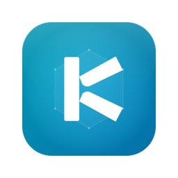

<p align="center">
  
</p>

<h1 align="center">Kamera</h1>

<p align="center">
  <strong>A native macOS Kubernetes dashboard built with SwiftUI</strong>
</p>

<p align="center">
  <a href="#features">Features</a>&ensp;&bull;&ensp;
  <a href="#installation">Installation</a>&ensp;&bull;&ensp;
  <a href="#keyboard-shortcuts">Keyboard Shortcuts</a>&ensp;&bull;&ensp;
  <a href="#building-from-source">Building</a>&ensp;&bull;&ensp;
  <a href="#license">License</a>
</p>

<p align="center">
  
  
  
</p>

---

Kamera connects directly to your Kubernetes clusters using your `~/.kube/config` &mdash; no proxy, no browser, no Electron. It reads cluster and auth configuration natively and talks to the K8s API over HTTPS with full TLS and exec-based credential support.

## Features

### 15 Resource Types

Browse all major Kubernetes resources organized into logical groups:

| Workloads | Config | Storage | Network | Cluster |
|-----------|--------|---------|---------|---------|
| Pods | ConfigMaps | PersistentVolumes | Services | Nodes |
| Deployments | Secrets | PersistentVolumeClaims | Ingresses | Events |
| StatefulSets | | | | |
| DaemonSets | | | | |
| ReplicaSets | | | | |
| Jobs | | | | |
| CronJobs | | | | |

### Cluster Health at a Glance

A status bar shows live counts of unready nodes, unhealthy pods, unavailable deployments, and failed jobs &mdash; all color-coded so problems are immediately visible.

### Multi-Cluster & Namespace Switching

Switch between contexts and namespaces from the sidebar. Supports **All Namespaces** mode to view resources across the entire cluster.

### Quick Search

Press **Cmd+K** to open a Spotlight-style search that finds resources by name across all types instantly.

### Live Pod Logs

Stream logs from any container in real-time with search filtering and auto-scroll.

### YAML Inspector

View the full YAML/JSON definition of any resource with syntax highlighting and in-document search.

### Related Resource Trees

Drill into any Deployment, StatefulSet, DaemonSet, Job, CronJob, or Node to see its child resources as an expandable tree (e.g. Deployment &rarr; ReplicaSets &rarr; Pods).

### Sortable Tables

Click any column header to sort resource lists. Filter with the built-in search bar per resource view.

### Auto-Refresh

Configurable auto-refresh at 15s, 30s, or 60s intervals to keep data current without manual action.

### Authentication

- Bearer token
- Client certificate (TLS mutual auth)
- Exec-based credentials (e.g. `aws eks get-token`)
- auth-provider (GKE gcp, OIDC)

## Keyboard Shortcuts

| Shortcut | Action |
|----------|--------|
| `Cmd + R` | Refresh resources |
| `Cmd + K` | Quick search |
| `Cmd + Up` | Previous resource kind |
| `Cmd + Down` | Next resource kind |

## Installation

### Download

Grab the latest `Kamera.dmg` from the [Releases](../../releases) page, open it, and drag **Kamera.app** into **Applications**.

> The app is not notarized &mdash; on first launch you may need to right-click &rarr; Open, or allow it in System Settings &rarr; Privacy & Security.

### Build from Source

Requires **Xcode 16+** and **macOS 14.4+**.

```bash
git clone https://github.com/Evalle/kamera.git
cd Kamera
make dmg
```

This builds a Release `.app` and packages it into `build/Kamera.dmg`. You can also open `Kamera.xcodeproj` in Xcode and hit Run.

### Prerequisites

- A valid `~/.kube/config` with at least one context configured
- Network access to your Kubernetes API server

## Building from Source

```bash
# Generate Xcode project (uses XcodeGen)
make generate

# Debug build
make build

# Release build
make release

# Package as .dmg
make dmg

# Run tests
make test

# Or use Swift Package Manager directly
swift build
swift test
```

## Architecture

Kamera is a single-target SwiftUI app with no external dependencies beyond [Yams](https://github.com/jpsim/Yams) for kubeconfig YAML parsing.

```
Sources/Kamera/
  App.swift                       # Entry point
  Models/
    KubeConfig.swift              # ~/.kube/config parsing
    Resources.swift               # All K8s resource types + computed helpers
    WatchEvent.swift              # Watch API event model
  ViewModels/
    ClusterViewModel.swift        # Central state: resources, health, search, navigation
  Services/
    AuthProvider.swift            # Token, cert, and exec auth
    KubernetesClient.swift        # HTTP client for K8s API
  Views/
    Sidebar/SidebarView.swift     # Context/namespace pickers + resource nav
    Resources/*.swift             # 15 resource list + detail views
    Logs/LogStreamView.swift      # Live pod log streaming
    Common/                       # Shared components (StatusBadge, QuickSearch, etc.)
```

## License

[MIT](LICENSE)
